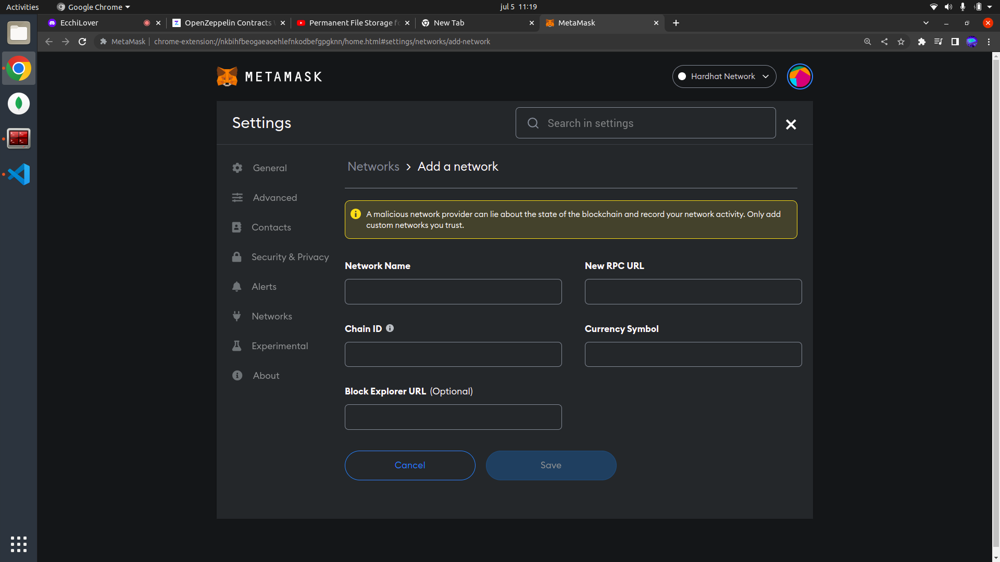

# Nft Sessions


## Descripción:

Nft Sessions es un proyecto pensado para la venta de tokens nft que otorgan el derecho a recibir sesiones formativas.
Para su desarrollo emplearemos Hardhat, React y Metamask entre otras tecnologías.

## Cómo importar la network en Metamask:

En la parte superior, donde tenemos las redes tenemos que seleccionar Add network.



Una vez hecho esto tenemos dos opciones:

La primera sería importar la local network si estamos trabajando con un nodo local. En este caso, la URL será http://localhost:8545 y el id de la cadena 31337.

La segunda consiste en importar la red de pruebas de Polygon (Mumbai). Los parámetros son los siguientes.
    
- Network Name: Mumbai Testnet

- New RPC URL: https://rpc-mumbai.maticvigil.com/

- Chain ID: 80001

- Currency Symbol: MATIC

- Block Explorer URL: https://polygonscan.com/

## Pasos a seguir para trabajar con Hardhat:

### Crear el proyecto
Para crear el proyecto utilizaremos el comando npx hardhat

La estructura resultante contendrá los siguientes archivos y directorios entre otros:

- Un directorio contracts con los contratos inteligentes a desplegar.
- Una carpeta artifacts con el material resultante de la compilación del contrato.
- Una carpeta scripts que contiene el archivo .js encargado de ejcutar el despliegue.
- Un archivo hardhat.config.js con la configuración necesaria para el despliegue.

### Editar el archivo hardhat.config
En este caso tendríamos dos opciones:
  
La primera opción sería configurar para el despliegue en un nodo local:

```
module.exports = {
  solidity: "0.8.4"
};
```

La segunda consiste en configurar para el despliegue en una red remota. En este caso utilizaremos la testnet de Polygon (Mumbai).

```
module.exports = {
  defaultNetwork: "matic",
  networks: {
    hardhat: {},
    matic: {
      url: "https://rpc-mumbai.maticvigil.com",
      accounts: [process.env.PRIVATE_KEY],
    },
  },
  etherscan: {
    apiKey: process.env.API_KEY,
  },
  solidity: {
    version: "0.8.4",
    settings: {
      optimizer: {
        enabled: true,
        runs: 200,
      },
    },
  },
};
```
    
La clave PRIVATE_KEY será de la wallet que vamos a emplear para hacer el despliegue. En caso de estar trabajando en remoto la clave privado la podremos obtener desde Metamask. Si en cambio, estamos trabajando en local, el nodo nos proporcionará pares de claves para con fondos para poder hacer operaciones.

Agregamos también la API_KEY de PolygonScan para poder verificar allí el contrato.

### Desplegar el contracto inteligente
Si vamos a trabajar en local deberemos ejecutar npx hardhat node

Si vamos a trabajar en remoto con la red de pruebas necesitaremos fondos para hacer el despliegue. Para ello, iremos a una faucet y pediremos que nos envíen fondos a nuestra wallet:


Nos llegarán los fondos a la wallet que le hamos indicado


Para compilar los contratos utilizaremos el comando npx hardhat compile

Para el despliegue emplearemos npx hardhat run scripts/sample-script.js aunque si vamos a desplegar en local es aconsejable utilizar npx hardhat run --network localhost scripts/sample-script.js para no tener problemas al arrancar el nodo en una consola y hacer el despliegue en otra.

Podemos comprobar el despliegue en polygonscan (para despliegues a una network remota):


## Open Zeppelin


Open Zeppelin es una librería que nos permite trabajar con contratos inteligentes ya testeados y normalizados. Esto nos permitirá dar una mayor robustez a nuestras apllicaciones descentralizadas.

### Instalación

Para instalar Open Zeppelin hemos empleado el comando npm install @openzeppelin/contracts. Una vez hecho esto, podremos importar el contrato que queramos en el nuestro mediante import "@openzeppelin/contracts/token/ERC721/ERC721.sol";

### Observaciones

Si, como ha sido mi caso, el import falla, deberemos pegar todos los contratos que necesitemos en la carpeta contracts y adaptar las importaciones a la nueva ruta.
La carpeta contracts quedaría de la siguiente manera:


